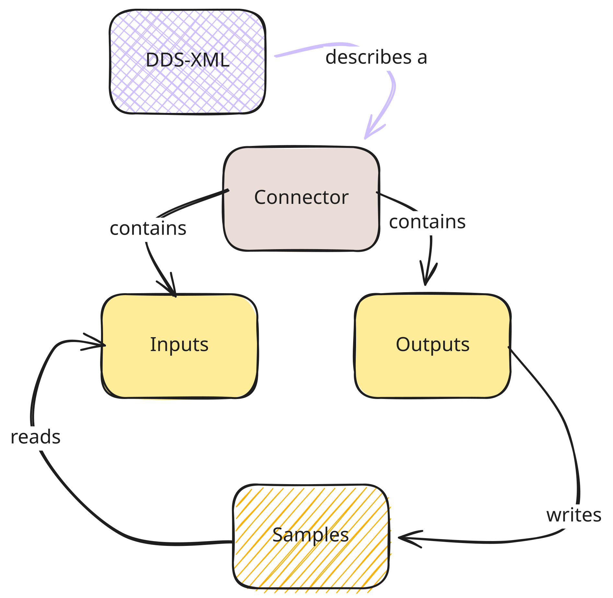

# RTI Connector for Connext DDS - Getting Started

*RTI Connext* is a software connectivity framework for real-time distributed applications.
It uses the DDS publish-subscribe communications model to make data distribution efficient and robust.
At its core is the world’s leading ultra-high performance, distributed networking databus.

*RTI Connector* is a simplified API that wraps RTI Connext Professional's XML Application Creation
feature where an XML file defines a DDS system.
For each participant in the system, you can create a Connector and use its Inputs and Outputs
(`DataReaders` and `DataWriters`, respectively) to send and receive samples using DynamicData.

*RTI Connector* is provided as a library in binary form for selected platforms,
with language bindings and examples provided in source format.

## Language Support

* **[JavaScript](https://github.com/rticommunity/rticonnextdds-connector-js)** (Fully supported)
* **[Go](https://github.com/rticommunity/rticonnextdds-connector-go)** (Experimental support only)
* **[Rust](https://github.com/rticommunity/rticonnextdds-connector-rust)** (Experimental support only)

> Connector for Python has been deprecated. A new full [Connext Python API][python-api] is available.
> The *Connext* [Migration Guide][python-migration] provides guidance to migrate from Connector for Python to the Connext Python API.

[python-api]: https://community.rti.com/static/documentation/connext-dds/current/doc/api/connext_dds/api_python/index.html "Python API documentation"
[python-migration]: https://community.rti.com/static/documentation/connext-dds/current/doc/manuals/migration_guide/700/product700/core700.html#migrating-from-connector-to-the-connext-python-api "Migration guide for Connector for Python to Connext Python API"

## Platform Support

Platform Support might differ between releases, check the [RTI Connector releases][connector-releases].

[connector-releases]: https://www.github.com/rticommunity/rticonnextdds-connector/releases "RTI Connector releases"

## Support

If you have questions, use the [RTI Community Forum][community-forum] or Github Issues.
If you have an active support contract with RTI, you can also use the[RTI Support Portal][support-portal].

[community-forum]: https://community.rti.com/ "RTI Community Forum"
[support-portal]: https://support.rti.com/ "RTI Support Portal"

## License

> *Note:* Each language binding may have its own license.
> Please refer to the specific language binding repository for more details.

This software is an experimental ("pre-production") product.
The Software is provided "as is," with no warranty of any type, including any warranty for fitness for any purpose.
RTI is under no obligation to maintain or support the software.
RTI shall not be liable for any incidental or consequential damages arising out of the use or inability to use the software.
